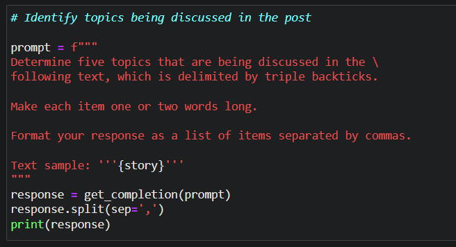
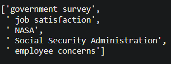
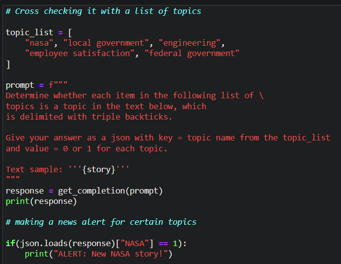
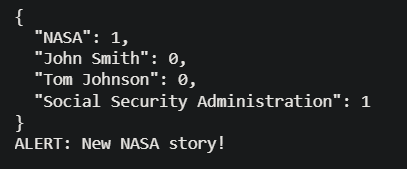

# Inferring emotions and sentiments

LLM's can be used to understand the customer's sentiment by using their review as in the below example:

|                                                     Customer Review                                                      |                                                Prompt to detect sentiment                                                |
| :----------------------------------------------------------------------------------------------------------------------: | :----------------------------------------------------------------------------------------------------------------------: |
|  |  |

---

Additionaly, as shown below, we can use the prompts to extract information and sentiments from the review(same as above):

|                                        Prompt along with the purpose (commented)                                         |                                                          Output                                                          |
| :----------------------------------------------------------------------------------------------------------------------: | :----------------------------------------------------------------------------------------------------------------------: |
|  |  |
|  |  |
|  |  |

The last prompt can also be modified as shown below to extract more info at the same time:

```python
prompt = f"""
Identify the following items from the review text:
- Sentiment (positive or negative)
- Is the reviewer expressing anger?
- Item purchased by reviewer
- Company that made the item

The review is delimited with triple backticks. \
Format your response as a JSON object with \
"Sentiment", "Anger", "Item" and "Brand" as the keys.
If the information isn't present, use "unknown" \
as the value.
Make your response as short as possible.
Format the Anger value as a yes/no.

Review text: '''{lamp_review}'''
"""
response = get_completion(prompt)
print(response)
```

---

<br>
Next, if we have the below text from a story or a post:

```python
story = """
In a recent survey conducted by the government,
public sector employees were asked to rate their level
of satisfaction with the department they work at.
The results revealed that NASA was the most popular
department with a satisfaction rating of 95%.

One NASA employee, John Smith, commented on the findings,
stating, "I'm not surprised that NASA came out on top.
It's a great place to work with amazing people and
incredible opportunities. I'm proud to be a part of
such an innovative organization."

The results were also welcomed by NASA's management team,
with Director Tom Johnson stating, "We are thrilled to
hear that our employees are satisfied with their work at NASA.
We have a talented and dedicated team who work tirelessly
to achieve our goals, and it's fantastic to see that their
hard work is paying off."

The survey also revealed that the
Social Security Administration had the lowest satisfaction
rating, with only 45% of employees indicating they were
satisfied with their job. The government has pledged to
address the concerns raised by employees in the survey and
work towards improving job satisfaction across all departments.
"""
```

Then we can use different prompts to extract the topics being discussed in it or cross check it with a list of topics that we provide as shown below:

| Prompt along with the purpose (commented) |          Output          |
| :---------------------------------------: | :----------------------: |
|                     |  |
|                   |  |
